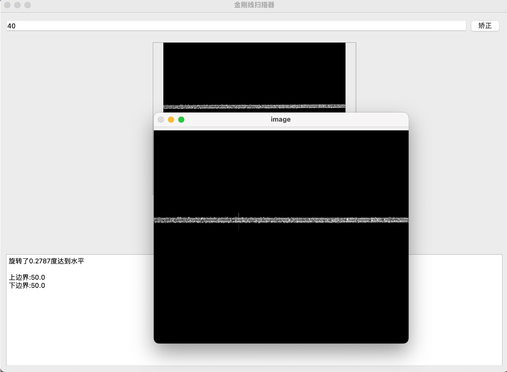
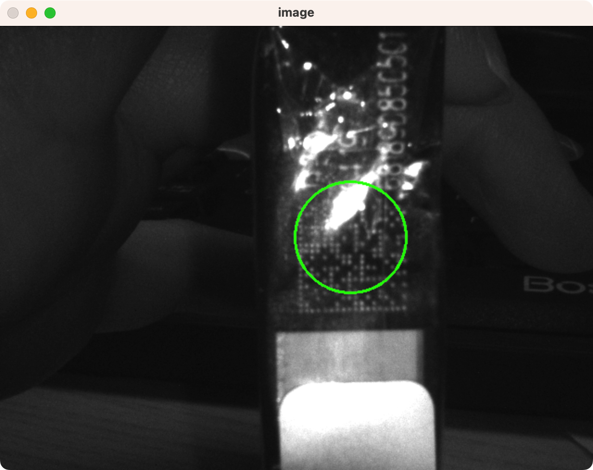

# HIT internship projects

### All in Cpp

**Python UI版请见 [https://github.com/xin700/Hit](https://github.com/xin700/Hit)**

**本项目共实现：**

**1. 金刚线度量检测**


**2. 金刚线最小圆检测**


**3.二维码传统算法定位**

**均已封装完毕，只需根据需要引用对应库的solve函数即可直接使用**


目录结构:

```
.
├── CMakeLists.txt
├── Img
├── Include
│   ├── dataMatrixSolver.h
│   ├── fileHandler.h
│   ├── imageHandler.h
│   ├── lineSolver.h
│   └── minCircleSolver.h
├── README.md
├── Src
│   ├── dataMatrixSolver.cpp
│   ├── fileHandler.cpp
│   ├── imageHandler.cpp
│   ├── lineSolver.cpp
│   └── minCircleSolver.cpp
└── main.cpp
```

### Requirements

```
1. c++17 (gnu++17) 及以上
2. CMake
3. OpenCV
4. Eigen3
```

**注意非MacOS系统用户请将CMakeLists中第11行set语句注释**

### Build

**note:**


**DEBUG 定义用于调试**

**SHOW 定义用于显示运算可视化**

**SHOW_TIME 定义用于显示计算所用时间**

```shell
mkdir build
cd build
cmake ..
make -j
```

## Algorithm Illustration

### **1. 金刚线度量检测**

实现金刚线的线距丝径，包络外径，出刃高度的计算。

在良好的矫正状态下，线距丝径以及包络外径大约可以控制在 ± 0.4μm，出刃高度约能控制在 ± 0.3μm。

**具体算法实现**

1. 对于图像进行矫正。由于图像照片会存在歪斜的情况，故首先需要对于图像进行水平的矫正，对应函数`cv::Mat lineSolver::rotate2horizon(cv::Mat image)`,函数使用随机采样法，对于直线的边界信息随机采样，之后对于所采集到的点集使用**最小二乘法**拟合直线，通过斜率计算放射矩阵进行变换。
2. 对于灰度阈值进行获取。灰度阈值是用来确定金刚线的灰度图像实际边界的阈值，通过二分法进行获取，可以在相同光照环境下的一个图像中找到长度对应的位置进行划线，之后算法通过对于灰度图像两侧局部单调区域进行二分，寻找出最合适当前光线、相机环境下的阈值。
3. 通过阈值进行金刚线度量的计算。根据所确定的阈值做边界的选取，因为精度的需要，所以对于边界的判定使用亚像素进行插值，之后通过对于边界的拟合，计算出金刚线的线距丝径，包络外径，出刃高度。

**使用方法**

```cpp
    auto answerData = lineSolver::solveLine(image);
    std::cout << "线距丝径: " << std::get<0>(answerData) << " μm" << std::endl;
    std::cout << "包络外径: " << std::get<1>(answerData) << " μm" << std::endl;
    std::cout << "出刃高度: " << std::get<2>(answerData) << " μm" << std::endl;
```

**运行截图**

<table>
  <tr>
    <td></td>
    <td></td>
  </tr>
  <tr>
    <td></td>
    <td></td>
  </tr>
</table>

### 2.金刚线最小圆检测

实现对于金刚线最小圆的检测，对于自然状态下金刚线所形成的圆具有良好的检测效果。

**具体算法实现**

1. 将线所含点集进行提取。对于图像进行二值化，之后以步长为 2 进行网格式扫描，扫描出所有的点集。
2. 清洗点集。对于所扫描出的点集进行清洗，去除掉一些明显不符合金刚线的点集，如过于稀疏的点集，过于密集的点集等，定义`kernel`，对于每个`kernel`大小范围只留下一个点，保证不会有过多的点进行干扰。
3. 循迹。算法的难点就在于循迹，本算法首先找到最左端端点作为起始点，对于点集按照x坐标进行排序，可以最大程度上节省寻找下一个点的时间，我们定义direction变量作为方向向量，我们首先根据direction向量对于下一个点进行预测，之后在预测点周围进行搜索，首先确定角度范围，这样可以避免路径出轨，使用A*算法进行搜索，将与预测点的距离以及与direction向量的角作为估价函数，找到最大收益地点作为下一个点。
4. 处理联通环。在循迹过程中会产生联通环，我们记录下这些联通环，并且寻找每个联通环中的每个点距离最远的点的距离的最小值，之后就可以认为次两个点构成最小圆。

**时间复杂度分析**

使用二叉平衡树进行优化,log由其产生。

总体时间复杂度为 `point.size() * log(point.size())`，其中`point.size()`为点集的大小。


**使用方法**

```cpp
    minCircleSolver::solveMinCircle(image);
```

**运行截图**
<table>
  <tr>
    <td></td>
    <td></td>
  </tr>
<tr>
    <td></td>
    <td></td>
  </tr>
</table>


### 二维码传统算法定位

在较为清晰的图片中可以对于工业二维码进行快速且准确的定位。

相较于机器学习算法，传统算法的二维码定位能够实现更快速且占用内存更小的优势，可以在一些资源有限的嵌入式设备上进行使用。

**具体算法实现**

这是一种与常规定位点算法有很大不同，一种创新性思路的二维码定位算法。

1. 对于图像进行`Shi-Tomasi Corners`检测，找到角点。
2. 之后我们对于角点部分进行膨胀，在空白图的基础上的到一张膨胀后的密集角点图像。
3. 之后我们对于图像进行若干次的腐蚀，使得松散的角点区域消失而只保留密集角点的二维码区域角点。
4. 使用`Tarjan`算法及`BFS`搜索。将整张像素图作为一张图，利用图论中的`Tarjan`算法配合`BFS`广度优先搜索算法，对于联通块进行查找，找到最大的联通块，即为二维码区域。
5. 取得最大联通块区域，找到联通块中的最远点，这就是此算法下的二维码的定位直径。

**使用方法**

```cpp
    auto points = dataMatrixSolver::solveDataMatrix(image);
    cv::circle(image,(points[0] + points[2]) / 2, minCircleSolver::real_distance(points[0],points[2]) / 2, cv::Scalar(0,255,0), 2);
    cv::imshow("image",image);
    cv::waitKey(0);
```

**运行截图**

<table>
  <tr>
    <td></td>
    <td></td>
  </tr>
<tr>
    <td></td>
    <td></td>
  </tr>
<tr>
    <td></td>
    <td></td>
  </tr>
</table>
<table>
  <tr>
    <td></td>
    <td></td>
  </tr>
<tr>
    <td></td>
    <td></td>
  </tr>
<tr>
    <td></td>
    <td></td>
  </tr>
</table>


### 二维码机器学习定位

详见 [https://github.com/xin700/Hit](https://github.com/xin700/Hit)
